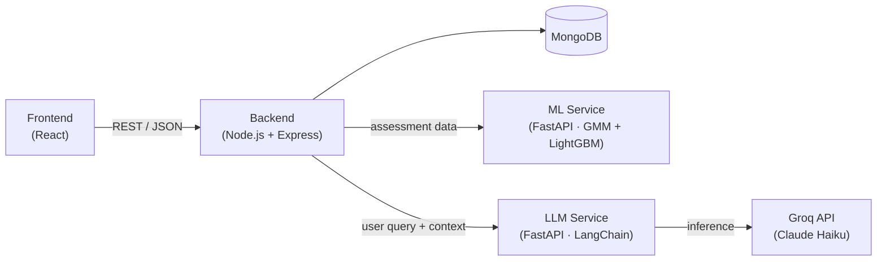

# LifeSync

**AI-powered personal life management platform** — unifying health, finance, productivity, and mental wellness tracking into a single, intelligent dashboard.

[](LICENSE)
[](https://nodejs.org/)
[](https://www.python.org/)
[](https://www.mongodb.com/)

---

## Table of Contents

1. [Introduction](#introduction)
2. [Demo](#demo)
3. [Features](#features)
4. [Architecture](#architecture)
5. [Working](#working)
6. [Tech Stack](#tech-stack)
7. [Project Structure](#project-structure)
8. [Quick Start](#quick-start)
9. [Contribution](#contribution)
10. [Contact](#contact)
11. [License](#license)

---

## Introduction

LifeSync is a multi-service platform that brings health, finance, productivity, and mental wellness tracking under one roof. Instead of relying on multiple disconnected apps, users complete a short onboarding assessment and receive a unified, continuously updating **Life Score**, along with AI-generated guidance that connects patterns across all four life domains (for example, how sleep quality affects productivity, or how stress correlates with spending habits).

The system is composed of four independent services — a web frontend, a backend orchestrator, a machine learning pipeline, and an LLM-based counselor — that communicate over REST APIs.

## Demo

> Add screenshots, a walkthrough GIF, or a short demo video below to showcase the dashboard, assessment flow, and AI counselor in action.

| Dashboard | Assessment | AI Counselor |
|---|---|---|
|  |  |  |

<!-- Optional: embed a video demo
[](https://your-demo-video-link)
-->

## Features

- **Cold-start profiling** — A 15-question assessment is expanded into 45+ behavioral features using Gaussian Mixture Model (GMM) clustering, so users get a meaningful profile without lengthy data collection.
- **Real-time life scoring** — A cascading model pipeline computes Health, Finance, Productivity, and Mental Wellness scores, which roll up into a single composite Life Score that updates as users interact with the platform.
- **AI counselor** — A LangChain-orchestrated agent reasons across all four domains and delivers personalized, context-aware recommendations rather than generic advice.
- **Secure authentication** — JWT-based session management with password hashing via bcrypt.
- **Responsive dashboard** — A React-based UI with real-time charts for tracking score trends over time.

## Architecture

LifeSync follows a service-oriented architecture: the frontend talks only to the backend, which in turn orchestrates calls to the ML and LLM services and persists state in MongoDB.



| Service | Responsibility | Port |
|---|---|---|
| Frontend | Dashboard UI, assessment flow, chat interface | 3000 |
| Backend | Authentication, request orchestration, score persistence, scheduled jobs | 4000 |
| ML Service | GMM clustering, feature engineering, cascade score prediction | 8000 |
| LLM Service | Domain-aware prompt routing and AI counselor responses | 9000 |

## Working

1. **Assess** — The user completes a 15-question onboarding assessment.
2. **Profile** — The ML service clusters the response vector with GMM and engineers 45+ behavioral features.
3. **Score** — A cascading sequence of LightGBM models converts those features into Health, Finance, Productivity, and Mental Wellness scores, which combine into a composite Life Score.
4. **Advise** — The LLM service routes the user's query and current scores to a domain-specific prompt, and the AI counselor returns a personalized recommendation.
5. **Iterate** — Every new interaction updates the user's features and scores, keeping the dashboard current.

## Tech Stack

| Layer | Technologies |
|---|---|
| Frontend | React, React Router, Recharts |
| Backend | Node.js, Express, Mongoose, JWT, bcrypt |
| Database | MongoDB |
| ML Pipeline | Python, FastAPI, scikit-learn, LightGBM, NumPy, Pandas |
| LLM Engine | LangChain, Groq API (Claude Haiku) |

## Project Structure

The repository is organized as four independent services plus shared project files. Each service has its own dependencies, environment configuration, and entry point.

```
LifeSync/
├── Backend/      # Node.js + Express API — auth, orchestration, scheduled jobs
├── Frontend/     # React single-page application — dashboard, assessment, chat UI
├── LLM/          # FastAPI service — LangChain-based AI counselor (Groq)
├── Models/       # Python ML pipeline — GMM clustering + LightGBM cascade models
├── LICENSE
└── README.md
```

Refer to the README inside each service directory (where available) for implementation-level details.

## Quick Start

### Prerequisites

- [Node.js](https://nodejs.org/) v16+
- [Python](https://www.python.org/) 3.8+
- [MongoDB](https://www.mongodb.com/cloud/atlas) (local instance or Atlas)
- [Groq API key](https://console.groq.com) (free tier available)
- [Git](https://git-scm.com/)

### Environment Setup

Create a `.env` file in each service directory.

**`Backend/.env`**
```env
PORT=4000
NODE_ENV=development
MONGODB_URI=mongodb://localhost:27017/lifesync
JWT_SECRET=your_jwt_secret_min_32_characters
ML_SERVICE_URL=http://localhost:8000
LLM_SERVICE_URL=http://localhost:9000
```

**`Frontend/.env`**
```env
REACT_APP_API_URL=http://localhost:4000
REACT_APP_ML_URL=http://localhost:8000
REACT_APP_LLM_URL=http://localhost:9000
```

**`Models/.env`**
```env
MONGODB_URI=mongodb://localhost:27017/lifesync
MODEL_PATH=./models/
DEBUG=true
```

**`LLM/.env`**
```env
GROQ_API_KEY=your_groq_api_key
MONGODB_URI=mongodb://localhost:27017/lifesync
LLM_MODEL=mixtral-8x7b-32768
TEMPERATURE=0.7
```

### Installation & Running

Clone the repository:

```bash
git clone https://github.com/DevSharma03/LifeSync.git
cd LifeSync
```

Start MongoDB:

```bash
# Docker (recommended)
docker run -d -p 27017:27017 --name lifesync-db mongo:latest

# or a local installation
mongod --dbpath /path/to/your/data
```

Start the backend:

```bash
cd Backend
npm install
npm start
# Runs on http://localhost:4000
```

Start the frontend:

```bash
cd Frontend
npm install
npm start
# Runs on http://localhost:3000
```

Start the ML service:

```bash
cd Models
pip install -r requirements.txt
uvicorn main:app --reload --port 8000
# API docs available at http://localhost:8000/docs
```

Start the LLM service:

```bash
cd LLM
pip install -r requirements.txt
python main.py
# Runs on http://localhost:9000
```

Once all four services are running, open **http://localhost:3000** to use LifeSync.

## Contribution

Contributions are welcome.

1. Fork the repository and create a feature branch:
   ```bash
   git checkout -b feature/your-feature-name
   ```
2. Make your changes, following the existing code style and adding comments for non-trivial logic.
3. Commit using a clear, descriptive message:
   ```bash
   git commit -m "feat: add your feature"
   ```
4. Push your branch and open a pull request against `main`, describing the change and its motivation.

Please open an [issue](https://github.com/DevSharma03/LifeSync/issues) for bugs or feature requests before submitting large changes.

## Contact

| Channel | Link |
|---|---|
| GitHub | [@DevSharma03](https://github.com/DevSharma03) |
| LinkedIn | [devashish-sharma](https://linkedin.com/in/devashish-sharma) |
| Issues | [Report a bug](https://github.com/DevSharma03/LifeSync/issues) |
| Discussions | [Join the conversation](https://github.com/DevSharma03/LifeSync/discussions) |

## License

This project is licensed under the [MIT License](LICENSE).
