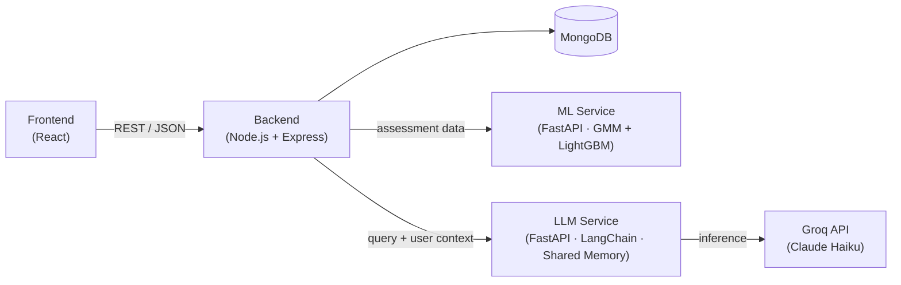

<div align="center">

# LifeSync

**AI-powered personal life management platform** — unifying health, finance, productivity, and mental wellness into a single, intelligent dashboard.

[](LICENSE)
[](https://nodejs.org/)
[](https://www.python.org/)
[](https://www.mongodb.com/)
[](#)

[Demo](#demo) · [Features](#features) · [Architecture](#architecture) · [Quick Start](#quick-start) · [Contributing](#contribution)

</div>

---

<details>
<summary><strong>Table of Contents</strong></summary>

1. [Introduction](#introduction)
2. [Demo](#demo)
3. [Features](#features)
4. [Architecture](#architecture)
5. [Working](#working)
6. [Tech Stack](#tech-stack)
7. [Project Structure](#project-structure)
8. [Quick Start](#quick-start)
9. [Contribution](#contribution)
10. [Contact](#contact)
11. [License](#license)

</details>

---

## Introduction

LifeSync is a multi-service platform that brings health, finance, productivity, and mental wellness tracking under one roof. Instead of relying on multiple disconnected apps, a user completes a short onboarding assessment and receives a unified, continuously updating **Life Score**, along with AI-generated guidance that connects patterns across all four life domains — for example, how sleep quality affects productivity, or how stress correlates with spending habits.

The system is composed of four independent services — a web frontend, a backend orchestrator, a machine learning pipeline, and an LLM-based counselor — that communicate over REST APIs.

> **Recognition** — LifeSync was presented as published research at **ICSICE Conference 2026** and received the **Best Final Year Project Award** for the 2022–26 B.Tech cohort.

## Demo

> Add screenshots, a walkthrough GIF, or a short demo video below to showcase the dashboard, assessment flow, and AI counselor in action.

<div align="center">

| Dashboard | Assessment | AI Counselor |
|:---:|:---:|:---:|
|  |  |  |

</div>

<!-- Optional: embed a video demo
[](https://your-demo-video-link)
-->

## Features

- **Cold-start profiling** — A 15-question assessment is expanded into 45+ behavioral features using Gaussian Mixture Model (GMM) clustering, so users get a meaningful profile without lengthy data collection.
- **Real-time life scoring** — A cascading sequence of LightGBM models computes Health, Finance, Productivity, and Mental Wellness scores, which roll up into a composite Life Score that updates after every user interaction.
- **Worker–orchestrator AI counselor** — A LangChain-based agent built on Claude Haiku (via Groq API) reasons across all four domains using shared memory, real-time profile and life-score injection from MongoDB, and conversational history.
- **Domain-specific prompt routing** — User queries are routed to specialized prompt templates per life domain, enabling personalized, multi-step reasoning instead of generic advice.
- **Secure authentication** — JWT-based session management with password hashing via bcrypt.
- **Responsive dashboard** — A React-based UI with real-time charts for tracking score trends over time.

## Architecture

LifeSync follows a service-oriented architecture: the frontend talks only to the backend, which orchestrates calls to the ML and LLM services and persists state in MongoDB.



| Service | Responsibility | Port |
|---|---|---|
| Frontend | Dashboard UI, assessment flow, chat interface | 3000 |
| Backend | Authentication, request orchestration, score persistence, scheduled jobs | 4000 |
| ML Service | GMM clustering, feature engineering, cascade score prediction | 8000 |
| LLM Service | Shared-memory orchestration, domain-specific prompt routing, AI counselor responses | 9000 |

## Working

1. **Assess** — The user completes a 15-question onboarding assessment.
2. **Profile** — The ML service clusters the response vector with GMM and engineers 45+ behavioral features.
3. **Score** — A cascading sequence of LightGBM models converts those features into Health, Finance, Productivity, and Mental Wellness scores, which combine into a composite Life Score.
4. **Advise** — The LLM service injects the user's real-time profile, current scores, and conversational history into a shared-memory context, routes the query to a domain-specific prompt, and the AI counselor returns a personalized, multi-step recommendation.
5. **Iterate** — Every new interaction updates the user's features and scores, keeping the dashboard current.

## Tech Stack

<table>
<tr>
<td><strong>Frontend</strong></td>
<td>


</td>
</tr>
<tr>
<td><strong>Backend</strong></td>
<td>


</td>
</tr>
<tr>
<td><strong>Database</strong></td>
<td>

</td>
</tr>
<tr>
<td><strong>ML Pipeline</strong></td>
<td>


</td>
</tr>
<tr>
<td><strong>LLM Engine</strong></td>
<td>


</td>
</tr>
</table>

## Project Structure

The repository is organized as four independent services plus shared project files. Each service has its own dependencies, environment configuration, and entry point.

```
LifeSync/
├── Backend/      # Node.js + Express API — auth, orchestration, scheduled jobs
├── Frontend/     # React single-page application — dashboard, assessment, chat UI
├── LLM/          # FastAPI service — LangChain-based AI counselor (Groq)
├── Models/       # Python ML pipeline — GMM clustering + LightGBM cascade models
├── LICENSE
└── README.md
```

Refer to the README inside each service directory (where available) for implementation-level details.

## Quick Start

### Prerequisites

- [Node.js](https://nodejs.org/) v16+
- [Python](https://www.python.org/) 3.8+
- [MongoDB](https://www.mongodb.com/cloud/atlas) (local instance or Atlas)
- [Groq API key](https://console.groq.com) (free tier available)
- [Git](https://git-scm.com/)

### Environment Setup

<details>
<summary>Create a <code>.env</code> file in each service directory</summary>

**`Backend/.env`**
```env
PORT=4000
NODE_ENV=development
MONGODB_URI=mongodb://localhost:27017/lifesync
JWT_SECRET=your_jwt_secret_min_32_characters
ML_SERVICE_URL=http://localhost:8000
LLM_SERVICE_URL=http://localhost:9000
```

**`Frontend/.env`**
```env
REACT_APP_API_URL=http://localhost:4000
REACT_APP_ML_URL=http://localhost:8000
REACT_APP_LLM_URL=http://localhost:9000
```

**`Models/.env`**
```env
MONGODB_URI=mongodb://localhost:27017/lifesync
MODEL_PATH=./models/
DEBUG=true
```

**`LLM/.env`**
```env
GROQ_API_KEY=your_groq_api_key
MONGODB_URI=mongodb://localhost:27017/lifesync
LLM_MODEL=mixtral-8x7b-32768
TEMPERATURE=0.7
```

</details>

### Installation & Running

Clone the repository:

```bash
git clone https://github.com/DevSharma03/LifeSync.git
cd LifeSync
```

Start MongoDB:

```bash
# Docker (recommended)
docker run -d -p 27017:27017 --name lifesync-db mongo:latest

# or a local installation
mongod --dbpath /path/to/your/data
```

Start the backend:

```bash
cd Backend
npm install
npm start
# Runs on http://localhost:4000
```

Start the frontend:

```bash
cd Frontend
npm install
npm start
# Runs on http://localhost:3000
```

Start the ML service:

```bash
cd Models
pip install -r requirements.txt
uvicorn main:app --reload --port 8000
# API docs available at http://localhost:8000/docs
```

Start the LLM service:

```bash
cd LLM
pip install -r requirements.txt
python main.py
# Runs on http://localhost:9000
```

Once all four services are running, open **http://localhost:3000** to use LifeSync.

## Contribution

Contributions are welcome.

1. Fork the repository and create a feature branch:
   ```bash
   git checkout -b feature/your-feature-name
   ```
2. Make your changes, following the existing code style and adding comments for non-trivial logic.
3. Commit using a clear, descriptive message:
   ```bash
   git commit -m "feat: add your feature"
   ```
4. Push your branch and open a pull request against `main`, describing the change and its motivation.

Please open an [issue](https://github.com/DevSharma03/LifeSync/issues) for bugs or feature requests before submitting large changes.

## Contact

<div align="center">

[](https://github.com/DevSharma03)
[](https://linkedin.com/in/devsharma09)
[](https://dev-portfolio-lyart-six.vercel.app/)
[](mailto:work.devashishsharma09@gmail.com)

</div>

| Channel | Link |
|---|---|
| Issues | [Report a bug](https://github.com/DevSharma03/LifeSync/issues) |
| Discussions | [Join the conversation](https://github.com/DevSharma03/LifeSync/discussions) |

## License

This project is licensed under the [MIT License](LICENSE).

<div align="center">

Built by [Devashish Sharma](https://github.com/DevSharma03)

</div>
